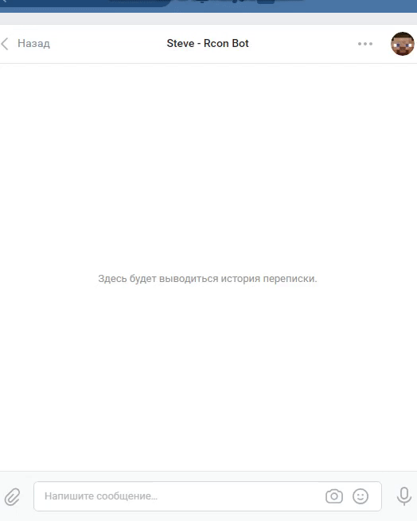

# Rcon Minecraft для ВКонтакте
Rcon Minecraft для ВКонтакте

***
Настройка бота для `сообщества`:
1. Открываем файл index.js.
2. Access Token:
- Переходим в настройки группы
- Открываем раздел `Работа с API`
- Нажимаем `Создать ключ`
- Отмечаем все галочки и нажимаем `создать`.
- Копируем ключ после его создания и вставляем в строку token.
- Нажимаем `Long Poll API`
- Включаем `Long Poll API`
- Открываем раздел `Сообщения`
- Включаем `Сообщения сообщества`
3. В строку `pollingGroupId` вписываем ID вашей группы VK, к которой будет прикреплён бот.
4. `let users = [1, 2, 3, 4, 5];`
- Вместо 1 2 3 4 5 вы можете вставлять id пользователей ВКонтакте, кто сможет испольнять команды Rcon, для всех остальных доступ запрещен.
7. Сохраняем файл и выходим.
***
by [MrZillaGold](https:/vk.com/egorlisss) - по всем вопросам
